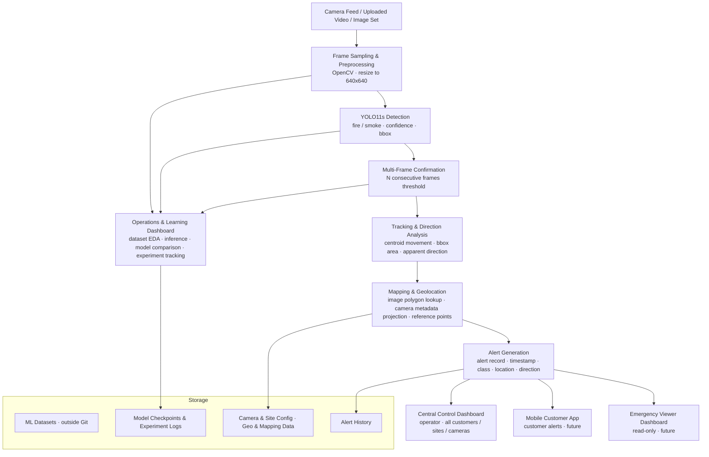

# PyroFinder — Project Context Brief

**Last updated:** 2026-06-10  
**Status:** M2 submitted; M3 active  
**Primary use:** Source-of-truth context for Claude, Claude Code, ChatGPT, Cursor, and future AI coding agents.

This document defines the canonical product context, ML scope, data strategy, architecture, repository expectations, and working rules for PyroFinder. If another project file conflicts with this file, treat this file as the product/source-of-truth document unless the project owners explicitly update it.

---

## 1. Project Identity

**Project name:** PyroFinder

**Tagline:** Real-time fire outbreak detection and monitoring using cameras that already exist at the customer site.

**Project type:** Location-based data science / computer vision web application.

**Course context:** Technion course 016833 — Location-Based Services: Data Science.

**Live app:** https://pyrofinder.streamlit.app/

**Local run command:**

```bash
streamlit run app.py
```

---

## 2. One-Liner

Private property owners in fire-prone areas suffer from delayed fire awareness, and PyroFinder turns existing cameras into a real-time fire/smoke monitoring layer using YOLO11s detection, multi-frame confirmation, and approximate map-based alerts.

---

## 3. Problem Being Solved

Private property owners in fire-prone areas often already have security cameras, but those cameras are passive: someone must actively watch the feed to notice smoke or fire. During dry seasons, fires can start at property edges, agricultural fields, forest borders, parking areas, or neighboring land, and delayed awareness can turn a small incident into a dangerous event.

Existing wildfire monitoring solutions often require dedicated towers, sensors, drones, satellite services, or public-sector infrastructure. PyroFinder fills a practical gap by reusing cameras the customer already owns and adding automated fire/smoke detection, alerting, approximate location context, and operational monitoring.

---

## 4. Core Product Definition

PyroFinder is a real-time fire outbreak detection and monitoring system built around customer-owned cameras.

The system:

1. Samples images or video frames from existing cameras or uploaded media.
2. Detects `fire` and `smoke` using a fine-tuned YOLO11s detector.
3. Confirms detections across multiple consecutive frames to reduce false alarms.
4. Estimates an approximate event location using image-space polygons, quadrants, or camera metadata when available.
5. Creates alert records and displays them in operational dashboards.
6. Supports ongoing model evaluation, EDA, experiment tracking, and model improvement through the Operations & Learning Dashboard.

YOLO11s is the detection engine inside the system. PyroFinder is not a pure YOLO demo; it is a monitoring and alerting system built on top of detection outputs.

---

## 5. What PyroFinder Is Not

PyroFinder must not be described as an **early warning system**.

PyroFinder does not:

- Predict true physical fire spread during the MVP.
- Integrate with live emergency dispatch infrastructure during this semester.
- Require dedicated towers, drones, acoustic sensors, or new hardware infrastructure.
- Claim precise geolocation.
- Claim fully automatic image-to-map registration unless explicitly marked as a future feature.
- Claim true geographic spread direction unless the camera has registered GPS coordinates and compass orientation.
- Use YOLOv12.
- Use generic unspecified “YOLO” wording when the model version matters.
- Train classes other than `fire` and `smoke`.
- Treat old classification-only datasets as a substitute for the object-detection task.
- Treat COCO zero-shot assumptions as a valid project baseline.

---

## 6. Target Audience

### Primary users and paying customers

Private property owners in fire-prone areas, including:

- Homeowners
- Farm owners
- Ranch owners
- Agricultural facility managers
- Private landowners

### Primary persona

Dani is a farm owner in central Israel who manages a 120-dunam farm with outdoor security cameras installed at boundary points. During dry summer months, fire risk from neighboring fields or agricultural equipment is high. Dani cannot continuously watch every camera feed, so PyroFinder monitors the feeds automatically and alerts Dani when fire or smoke is confirmed.

### Main use case

A fire ignites at the edge of Dani's property. PyroFinder detects smoke or fire in a camera feed, confirms the detection across multiple frames, creates an alert within seconds, and shows the approximate event location as a named image polygon, image quadrant, or approximate map point when camera metadata is available.

### Secondary users

Municipalities, emergency response teams, rescue teams, forest authorities, and park authorities may receive approximate alert information when a detected fire may affect public or shared-responsibility areas.

### Internal users

PyroFinder team members and developers use the Operations & Learning Dashboard to inspect data, run EDA, compare models, test inference, analyze false alarms, and improve the system.

---

## 7. Product Structure

PyroFinder consists of three operational products and one internal product.

### 7.1 Central Control Dashboard

**Users:** PyroFinder operator / admin.

**Purpose:** Operational control center for managing customers, sites, cameras, mapping setup, and alert history.

**Core capabilities:**

- Show customers, sites, and cameras on a basic map.
- Show camera health, active detections, alert history, camera metadata, and mapping status.
- Support manual editing of camera location, height, azimuth, indoor/outdoor flag, responsibility zones, and image polygons.
- Display active fire/smoke events with approximate location and status.
- Support alert review, confirmation, rejection, and false-alarm marking.

**MVP status:** A basic version is part of the course MVP.

### 7.2 Mobile Customer App

**Users:** End customer / property owner.

**Purpose:** Customer-facing interface for receiving alerts and monitoring their own sites.

**Core capabilities:**

- Receive fire/smoke alerts with approximate event location.
- Show customer cameras, sites, and responsibility areas.
- Allow confirming, rejecting, or marking alerts as false alarms.
- Show active events on a map relative to the property.

**MVP status:** Future / out of scope this semester.

### 7.3 Emergency / Third-Party Viewer Dashboard

**Users:** Firefighting teams, rescue services, municipalities, forest authorities, and similar third parties.

**Purpose:** Read-only or limited-access view of active alerts and approximate locations relevant to public or shared-responsibility areas.

**MVP status:** Future / optional product anchor. Not part of the first MVP unless explicitly prioritized later.

### 7.4 Operations & Learning Dashboard

**Users:** PyroFinder internal team — developers, data scientists, and researchers.

**Purpose:** Primary course MVP deliverable and internal tool for building, testing, evaluating, and improving the detection system.

**Core capabilities:**

- Dataset loading and inspection.
- D-Fire Data Card and EDA.
- Model comparison: sklearn baselines, YOLO11n baseline, planned YOLO11s primary detector.
- Uploaded image/video inference demo.
- Detection overlay with bounding boxes.
- Evaluation metrics: mAP@0.5, mAP@0.5:0.95, precision, recall, F1, false alarm rate, and inference speed.
- Performance breakdown by conditions when such metadata exists.
- False positive / false negative review.
- Experiment tracking.
- Manual image polygon definition.
- Basic polygon-to-map linking placeholders.
- Camera metadata table.
- Basic map display.
- Alert log from test runs.

---

## 8. Data Strategy

All ML training data must be normalized to a strict two-class detection schema:

- `fire`
- `smoke`

Other labels such as `human` or `vehicle` must not be trained as fire/smoke. They may be used only as background negatives or future situational-awareness context.

Large raw datasets must stay outside Git. Model weights must stay outside Git unless explicitly approved and small enough for repository policy.

---

## 9. Primary Dataset — D-Fire

**Dataset:** D-Fire  
**URL:** https://github.com/gaia-solutions-on-demand/DFireDataset  
**Role:** Primary training and held-out test evaluation dataset.  
**License:** CC0 1.0 Universal.  
**Annotation format:** YOLO-format normalized bounding boxes.  
**Classes used by PyroFinder:** `fire`, `smoke`.

### Current verified counts

| Item | Value |
|---|---:|
| Total images | 21,527 |
| Train images | 17,221 |
| Test images | 4,306 |
| Background images | 9,838 |
| Smoke-only images | 5,867 |
| Fire-only images | 1,164 |
| Fire-and-smoke images | 4,658 |
| Fire bounding boxes | 14,692 |
| Smoke bounding boxes | 11,865 |

### D-Fire class mapping

D-Fire has no reliable `data.yaml` in the local download. The class mapping was verified empirically by comparing generated category counts against the official D-Fire counts.

| Class ID | Class name |
|---:|---|
| 0 | smoke |
| 1 | fire |

Do not invert this mapping.

### Generated metadata CSV

`data/dfire_metadata.csv` is generated by `scripts/build_dfire_metadata.py` and is committed to Git. The app should be able to run on a fresh clone using this CSV without requiring the raw D-Fire dataset.

Current CSV shape: **21,527 rows × 36 columns**.

Important columns include:

- `image_id`
- `split`
- `image_category`
- `has_fire`
- `has_smoke`
- `num_fire_boxes`
- `num_smoke_boxes`
- `total_boxes`
- `fire_bbox_coverage`
- `smoke_bbox_coverage`
- `mean_brightness`
- `dark_pixel_ratio`
- `color_std_mean`
- `fire_mean_x_center`
- `fire_mean_y_center`
- `smoke_mean_x_center`
- `smoke_mean_y_center`
- `fire_thirds_col`
- `fire_thirds_row`
- `smoke_thirds_col`
- `smoke_thirds_row`
- `smoke_dy_vs_fire`
- `smoke_dx_vs_fire`
- `fire_smoke_mean_iou`

Regeneration command:

```bash
python scripts/build_dfire_metadata.py --raw-root "<path-to-D-Fire-root>" --output data/dfire_metadata.csv
```

Optional sample-copy command:

```bash
python scripts/build_dfire_metadata.py --raw-root "<path-to-D-Fire-root>" --output data/dfire_metadata.csv --copy-samples data/samples/dfire --sample-count 20
```

### Current EDA findings

These findings are based on the current generated metadata CSV:

- Background images are the largest category: **9,838 / 21,527 images**.
- A naive classifier can achieve non-trivial accuracy by predicting background; therefore accuracy alone is misleading.
- Fire-only images have a much higher dark-pixel ratio than smoke-only images in the current metadata: about **64.1%** vs **8.5%** on average.
- Smoke bounding boxes are much larger than fire bounding boxes on average: about **7.3×** larger by mean normalized area.
- In fire-and-smoke images, the smoke centroid appears above the fire centroid in about **94.6%** of cases.

### Known dataset gaps and biases

- Limited representation of night scenes, indoor fires, and close-range agricultural fires.
- Dataset skews toward outdoor wildland scenes.
- Ordinary private-property camera angles may differ from benchmark imagery.
- Smoke may be confused with clouds, fog, dust, haze, glare, or bright sky backgrounds.
- Real deployment requires validation beyond D-Fire.

---

## 10. Supplementary and Validation Datasets

These datasets are candidates only. Before use, labels must be verified and normalized to `fire` / `smoke`.

| Dataset | Role | Notes |
|---|---|---|
| Smart Fire System Dataset | Supplementary training / external validation | Use the dataset only; do not assume repository code or trained model quality. |
| Aerial Rescue Object Detection | Robustness validation | Use Fire class for evaluation; Vehicle/Human only as background negatives. |
| Fire Detection in YOLO Format | Supplementary training after verification | Small dataset; class compatibility must be verified. |
| FURG Fire Dataset | Video validation | Useful for temporal behavior, multi-frame confirmation, tracking, and apparent direction estimation. |

---

## 11. Formal ML Problem

**Task:** Two-class object detection.

**Input X:** RGB images or sampled video frames from outdoor cameras, resized to 640 × 640 pixels.

**Output y:** Per-frame set of detections. Each detection contains:

- Bounding box: `(x_center, y_center, width, height)` in normalized coordinates.
- Class label: `fire` or `smoke`.
- Confidence score: value in `[0, 1]`.

**Primary model:** Ultralytics YOLO11s, initialized from `yolo11s.pt`, fine-tuned on D-Fire.

**Reason for model choice:** YOLO11s is the planned primary detector because PyroFinder needs near-real-time sampled-frame inference with stronger detection quality than the smallest YOLO11n model.

**Baseline / fallback:** Ultralytics YOLO11n, initialized from `yolo11n.pt`, fine-tuned on the same data. YOLO11n is the lightweight speed baseline and fallback only. It is not an equal parallel model.

**Loss:** Ultralytics YOLO detection loss, including bounding-box regression, classification loss, and distribution focal loss as implemented by YOLO11.

**Metrics:**

- mAP@0.5
- mAP@0.5:0.95
- Precision
- Recall
- F1-score
- False Alarm Rate, measured as false positives per hour or per 1,000 sampled frames
- Inference speed, measured in FPS or milliseconds per frame

**Primary KPI statement:** The model is a two-class object detection model, the primary metric is Recall, because missing a real fire or smoke event is more costly than triggering a false alarm.

**Split:** Use D-Fire's provided train/test split. If a different dataset has no split, use a reproducible stratified split by image category.

---

## 12. Baselines and Current M3 Results

### 12.1 Sklearn image-level baselines

The sklearn baselines are image-level classifiers, not object detectors. They classify an entire image as `background`, `fire`, or `smoke` based on handcrafted color features.

Feature vector:

- RGB mean per channel — 3 values
- RGB std per channel — 3 values
- HSV mean per channel — 3 values
- HSV std per channel — 3 values
- RGB color histogram, 16 bins × 3 channels — 48 values
- Total: 60 values
- Image resize: 64 × 64

Label derivation:

- Class 1 present → `fire`
- Class 0 only → `smoke`
- Empty label file → `background`

Current results on full D-Fire:

| Model | Accuracy | Macro F1 | Fire recall | Smoke recall | Notes |
|---|---:|---:|---:|---:|---|
| DummyClassifier | 0.4700 | 0.2100 | 0.0000 | 0.0000 | Minimum bar only; always predicts background. |
| Logistic Regression | 0.6078 | 0.6151 | 0.7462 | 0.6661 | Shows color features contain useful signal, but false alarms remain high. |
| Random Forest | 0.8579 | 0.8486 | 0.7973 | 0.8145 | Strongest classical image-level baseline. |

Result files:

- `results/baseline_dummy_classifier.json`
- `results/baseline_logistic_regression.json`
- `results/baseline_random_forest.json`

Important distinction: these classifiers do not produce bounding boxes. They cannot replace YOLO11s because PyroFinder requires object localization for approximate location and alert context.

### 12.2 YOLO11n object-detection baseline

YOLO11n is the lightweight object-detection baseline and fallback. It must be compared to YOLO11s using detection metrics, not sklearn accuracy or macro F1.

Training/evaluation details:

| Item | Value |
|---|---|
| Platform | Kaggle Notebook |
| GPU | Tesla T4 |
| Dataset | D-Fire |
| Train images | 17,221 |
| Test images | 4,306 |
| Classes | 0 = smoke, 1 = fire |
| Image size | 640 px |
| Epochs requested | 30 |
| Batch size | 16 |

Final YOLO11n metrics:

| Metric | Value |
|---|---:|
| mAP@0.5 | 0.7470 |
| mAP@0.5:0.95 | 0.4249 |
| Precision | 0.7397 |
| Recall | 0.6825 |
| F1 | 0.7099 |

Result files:

- `results/baseline_yolo11n.json`
- `results/results_yolo11n.csv`
- `models/yolo11n_dfire_best.pt` — local only, Git-ignored
- `scripts/YOLO11n_baseline.py` — reproducible runner

YOLO11s remains the planned primary detector. YOLO11s should be selected as the main model only if it improves detection quality, especially mAP@0.5 and recall, while preserving acceptable inference speed.

---

## 13. Detection, Tracking, and Alert Logic

### Detection

Detection is performed frame-by-frame using a fine-tuned YOLO11s detector. The detector outputs only two classes: `fire` and `smoke`.

### Multi-frame confirmation

PyroFinder does not trigger an alert from a single-frame detection. A confirmed alert requires a fire or smoke detection above the configured confidence threshold across `N` consecutive frames from the same camera.

`N` is configurable. The default working value is 3 unless changed through configuration.

### Fire location estimation

Fire detections are used to estimate an approximate fire location. The default approximation is based on bounding-box centroid and image-space mapping.

Allowed location outputs:

- Named image polygon, e.g. `north field`
- Image quadrant, e.g. `lower-left quadrant`
- Approximate map point when camera metadata and mapping setup are available

Do not claim precise geolocation.

### Smoke direction estimation

Smoke detections are used to estimate apparent smoke movement direction from centroid movement, bounding-box persistence, and shape changes across frames.

Allowed wording:

- `apparent smoke direction`
- `image-plane direction`
- `estimated direction based on smoke movement`

Do not claim true wind direction unless explicitly validated.

### Spread-direction estimation

The MVP estimates apparent image-plane direction only. It does not predict true physical fire spread.

Allowed wording:

- `apparent direction in the camera frame`
- `image-plane spread direction`
- `expanding toward upper-right of frame`
- `approximate fire location based on camera projection`

---

## 14. Mapping and Geolocation Strategy

Mapping is an offline, pre-event setup stage. It is not solved during a live fire event.

Map and geo data are operational configuration, not YOLO training data.

Supported mapping modes:

1. **Manual responsibility zone definition** — mark areas in the camera image as in-scope or out-of-scope.
2. **Manual polygon creation and naming** — draw polygons such as `north field`, `parking area`, `forest edge`, `access road`, `fence line`, or `orchard`.
3. **Image-to-map polygon linking** — link an image polygon to a map polygon, terrain cell, or map point.
4. **Manual or GPS-based camera location setup** — store camera latitude/longitude when available.
5. **Camera metadata setup** — height, azimuth, indoor/outdoor flag, field of view, zoom state if available.
6. **Reference-point mapping** — mark landmarks that appear both in the camera image and on the map.

Automatic image-to-map registration is future/advanced work and is not required for the course MVP.

Candidate mapping libraries:

- Folium
- streamlit-folium
- Shapely
- GeoPandas, if later needed
- Rasterio / PyProj, only if DEM or advanced GIS work is explicitly added later

---

## 15. Technical Architecture



Layer summary:

1. Camera / uploaded media input.
2. Frame sampling and preprocessing.
3. YOLO11s detection.
4. Multi-frame confirmation.
5. Tracking and apparent direction analysis.
6. Mapping and approximate geolocation.
7. Alert generation.
8. Dashboard display and model-evaluation workflow.

Live RTSP ingestion is not required for this semester.

---

## 16. Input / Output Schema

| Object | Key fields |
|---|---|
| Customer | `customer_id`, `name`, `contact_info` |
| Site / property | `site_id`, `customer_id`, `name`, `location_polygon`, `address` |
| Camera | `camera_id`, `site_id`, `name`, `status` |
| Camera metadata | `camera_id`, `latitude`, `longitude`, `height_m`, `azimuth_deg`, `fov_horizontal_deg`, `fov_vertical_deg`, `indoor_outdoor`, `zoom_state` |
| Image polygon | `polygon_id`, `camera_id`, `name`, `vertices`, `polygon_type`, `linked_map_polygon_id` |
| Map polygon | `map_polygon_id`, `site_id`, `name`, `geometry`, `polygon_type` |
| Reference point | `ref_point_id`, `camera_id`, `image_x`, `image_y`, `map_lat`, `map_lon`, `label` |
| Frame input | `timestamp`, `camera_id`, `image` |
| Detection output | `timestamp`, `camera_id`, `class`, `confidence`, `bbox` |
| Tracking output | `timestamp`, `camera_id`, `track_id`, `centroid`, `bbox_area`, `apparent_direction`, `matched_image_polygon_id`, `approximate_map_location` |
| Alert | `alert_id`, `timestamp`, `camera_id`, `site_id`, `customer_id`, `detected_class`, `confidence`, `apparent_direction`, `image_polygon_name`, `approximate_lat`, `approximate_lon`, `geographic_bearing`, `status` |
| Model experiment | `experiment_id`, `model_name`, `dataset`, `split`, `hyperparameters`, `metrics`, `notes`, `timestamp` |
| Dataset record | `dataset_id`, `name`, `source_url`, `num_images`, `classes`, `split_info`, `license`, `role` |
| Evaluation run | `run_id`, `experiment_id`, `dataset_id`, `split`, `metrics`, `timestamp` |

Allowed detection classes are only `fire` and `smoke`.

---

## 17. Current Repository Structure

```text
app.py
requirements.txt
README.md
CLAUDE.md
PROJECT_CONTEXT.md
AI_AGENT_SYSTEM.md
ASSISTANT_WORKING_RULES.md
.env.example
.gitignore

src/
  data.py
  eda.py
  viz.py
  ui.py
  model.py
  detection.py
  tracking.py
  mapping.py
  alerts.py

scripts/
  build_dfire_metadata.py
  dummy_try.py
  simple_baselines.py
  YOLO11n_baseline.py

data/
  dfire_metadata.csv
  samples/dfire/images/
  samples/dfire/labels/

results/
  baseline_dummy_classifier.json
  baseline_logistic_regression.json
  baseline_random_forest.json
  baseline_yolo11n.json
  results_yolo11n.csv

models/
  yolo11n_dfire_best.pt   # local only, Git-ignored

docs/
  M2_DATA_EDA.md
  M2_dashboard.md
  M2_GAP_LIST.md
  Literature_review.md
  market_survey_wildfire_existing_sensors.md
  AI_AGENT_SYSTEM.md      # optional docs copy if kept there

tests/
  test_smoke.py
```

Important note: `ASSISTANT_WORKING_RULES.md` should be kept at the repository root next to `PROJECT_CONTEXT.md`, `CLAUDE.md`, and `README.md`, because it is a source-of-truth instruction file for all future AI sessions.

---

## 18. Requirements and Runtime

Current Python dependencies are defined in `requirements.txt`:

- pandas
- streamlit
- plotly
- scikit-learn
- pytest
- numpy
- Pillow
- opencv-python-headless
- ultralytics
- PyYAML
- folium
- streamlit-folium
- shapely

Run tests:

```bash
python -m pytest tests
```

Run app:

```bash
streamlit run app.py
```

---

## 19. Git and File Policy

Do not commit:

- Raw datasets
- Full training runs
- Model weights
- Local `.env` files
- Secrets
- Local machine paths in reusable code
- Cache files
- Large video files
- Large raster / DEM data

Allowed committed data/artifacts:

- `data/dfire_metadata.csv`
- Small committed sample images and labels under `data/samples/dfire/`
- Result JSON files under `results/`
- Training curve CSV under `results/`
- Documentation under `docs/`
- Design assets explicitly allowed by `.gitignore`

---

## 20. Current MVP Priority

M2 is submitted. M3 is active.

Current status:

1. Streamlit shell running — done.
2. Dataset inspection and metadata display — done.
3. D-Fire EDA — done.
4. Uploaded image/video inference placeholder — done.
5. DummyClassifier baseline — done.
6. Logistic Regression and Random Forest baselines — done.
7. YOLO11n object-detection baseline — done.
8. YOLO11s model loading / fine-tuning — next.
9. Alert log from test runs — next.
10. Camera metadata table — next.
11. Manual image polygon and map-linking placeholders — next.

Recommended next M3 work order:

1. Deepen the baseline result analysis and document conclusions.
2. Create `docs/M3_RESULTS_SUMMARY.md` after the analysis is stable.
3. Implement or finalize YOLO11s inference path in `src/detection.py`.
4. Add alert log and N-frame confirmation tests.
5. Add camera metadata table and basic map view.
6. Run `python -m pytest tests` after code changes.
7. Run `streamlit run app.py` after Streamlit layout changes.

---

## 21. Documentation Map

| File | Role |
|---|---|
| `PROJECT_CONTEXT.md` | Canonical product context, ML scope, data strategy, architecture, current status. |
| `CLAUDE.md` | Coding-agent context: repo structure, module responsibilities, current implementation status. |
| `README.md` | External-facing project description and reproducibility notes. |
| `AI_AGENT_SYSTEM.md` | Agent roles, workflows, prompts, operating procedures. |
| `ASSISTANT_WORKING_RULES.md` | General communication, accuracy, coding, and session rules for AI assistants. |
| `docs/M2_DATA_EDA.md` | D-Fire data workflow, class mapping, EDA documentation. |
| `docs/M2_dashboard.md` | M2 dashboard requirements and dashboard design notes. |
| `docs/M2_GAP_LIST.md` | Historical M2 audit and known M2 gaps. Keep as archive unless still needed. |
| `docs/Literature_review.md` | Literature review and project lessons. |
| `docs/market_survey_wildfire_existing_sensors.md` | Market survey and competitor positioning. |
| `docs/M3_RESULTS_SUMMARY.md` | To be created after deeper M3 result analysis. |

Update rule:

- If product scope, model choice, data strategy, or terminology changes — update `PROJECT_CONTEXT.md`.
- If repo structure, module responsibilities, or current coding status changes — update `CLAUDE.md`.
- If agent workflows or prompts change — update `AI_AGENT_SYSTEM.md`.
- If assistant behavior or working style changes — update `ASSISTANT_WORKING_RULES.md`.
- If public-facing project claims change — update `README.md`.

---

## 22. User Stories

### Story 1 — Customer receives confirmed fire/smoke alert

As a property owner, I want to receive an alert when fire or smoke is confirmed in any of my camera feeds, so that I can respond without manually watching every camera.

**Acceptance criterion:** When YOLO11s detects fire or smoke above the configured threshold across `N` consecutive frames, the dashboard displays a confirmed alert with camera identifier, timestamp, class, confidence, and approximate location if available.

### Story 2 — Operator sees cameras on a central map

As a PyroFinder operator, I want to see all customers, sites, and cameras on a basic map so that I can monitor operational status from one screen.

**Acceptance criterion:** The Central Control Dashboard displays registered cameras as map markers. Clicking a marker shows camera status, recent alerts, and metadata.

### Story 3 — Operator defines image polygons and links them to map areas

As a PyroFinder operator, I want to draw named polygons on each camera image and link them to map areas so that detections can be reported as approximate property locations.

**Acceptance criterion:** The operator can define at least one named image polygon and a test detection inside that polygon returns the polygon name.

### Story 4 — Internal user compares model performance

As a PyroFinder developer, I want to compare sklearn baselines, YOLO11n, and YOLO11s so that I can justify the production model choice.

**Acceptance criterion:** The Operations & Learning Dashboard displays metric cards and comparison tables. YOLO11n and YOLO11s are evaluated with detection metrics, not sklearn classification metrics.

### Story 5 — Internal user reviews false alarms

As a PyroFinder developer, I want to review false positives and false negatives so that I can understand model failure modes and improve training and thresholds.

**Acceptance criterion:** The dashboard records test alerts and allows marking them as confirmed, rejected, or false alarm.

---

## 23. Research Gap

Existing models often perform well on curated benchmark datasets but are less often validated as practical camera-ready monitoring systems for ordinary private-property camera feeds.

PyroFinder addresses this gap by combining two-class fire/smoke object detection, multi-frame confirmation, false-alarm review, approximate location output, and an operations dashboard built around existing cameras.

---

## 24. Market Positioning

PyroFinder's market gap is a low-friction software layer for sites that already have cameras.

Competitor categories:

- Camera tower solutions: strong visual detection, but require dedicated camera stations.
- Acoustic sensor networks: useful in blind spots, but require specialized hardware.
- Drones: flexible, but operationally complex.
- Satellites: strong wide-area intelligence, but not based on local customer-owned cameras.
- Suppression systems: focus on defense/suppression rather than software-first detection from existing cameras.

PyroFinder's positioning: use customer-owned camera infrastructure first, then add AI detection, multi-frame confirmation, approximate location, and alert workflow.

Do not invent market-size numbers unless a verified source is provided.

---

## 25. AI Agent Instructions

Future AI coding agents should:

- Use this file as the source of truth.
- Use Python and Streamlit.
- Use YOLO11s as the planned primary detector.
- Use YOLO11n only as the lightweight speed baseline/fallback.
- Keep classes strictly `fire` and `smoke`.
- Do not load heavy ML models at import time.
- Keep code modular, readable, and testable.
- Use English for files, code, comments, documentation, and UI text.
- Keep large datasets, model weights, and secrets outside Git.
- Treat mapping and geo data as operational configuration, not ML training data.
- Mark all location outputs as approximate.
- Run tests after code changes:

```bash
python -m pytest tests
```

- Run the app after Streamlit layout changes:

```bash
streamlit run app.py
```

Do not:

- Describe PyroFinder as an early warning system.
- Add emergency dispatch integration to the MVP.
- Add full mobile app implementation to the MVP.
- Make live RTSP production streaming mandatory for the MVP.
- Add dedicated hardware assumptions.
- Claim precise geolocation.
- Claim automatic image-to-map registration.
- Claim true physical fire-spread prediction.
- Use YOLOv12.
- Use generic “YOLO” wording when YOLO11s or YOLO11n is meant.
- Train classes other than `fire` and `smoke`.

---

## 26. Future Prompt Rule

When asking an AI agent to write code, update documentation, or plan work for PyroFinder, include this instruction:

```text
Use PROJECT_CONTEXT.md as the source of truth. Do not change the product scope, model choice, dataset strategy, terminology, or target audience unless explicitly requested. Prefer CLAUDE.md for current code/repo status, AI_AGENT_SYSTEM.md for agent workflows, and ASSISTANT_WORKING_RULES.md for assistant behavior.
```
