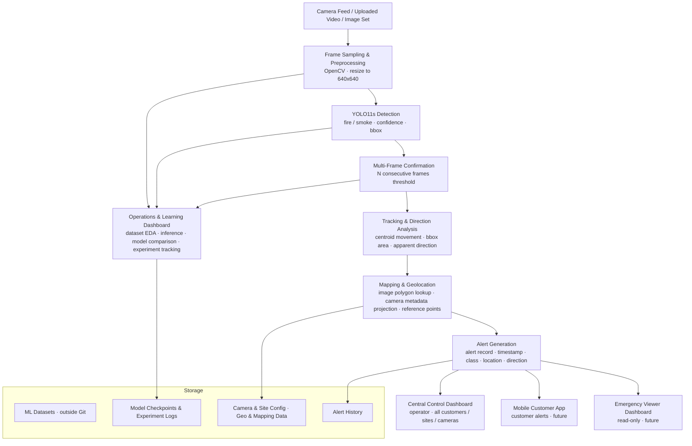

# lisa-boris
ליסה + בוריס — פרויקט קורס LBS (016833)

# PyroFinder

**Real-time fire outbreak detection and monitoring using cameras that already exist at the customer site.**

---

## One-Liner

Private property owners in fire-prone areas suffer from delayed fire awareness, we will build PyroFinder — a real-time fire monitoring system that uses existing cameras, YOLO11s model for fire/smoke detection, and approximate map-based alerts.

---

## Problem Statement

Private property owners: homeowners, farm owners, ranch owners, agricultural facility managers, and private landowners, install security cameras at their properties, but those cameras are passive. Someone must actively watch every feed to notice smoke or fire. During dry seasons, fires can start at property edges, agricultural fields, forest borders, parking areas, or neighboring land. By the time the event is noticed, it may already be well-established.

Existing wildfire monitoring solutions require dedicated towers, sensors, drones, or public-sector infrastructure built for land agencies, not individual property owners. PyroFinder fills this gap by turning cameras the customer already owns into an automated fire/smoke monitoring layer,  with multi-frame confirmation, approximate location output, and operational visibility — without any new hardware.

---

## Target Audience

**Primary users and paying customers:** homeowners, farm owners, ranch owners, agricultural facility managers, and private landowners in fire-prone areas.

**Primary persona: Dani, farm owner, central Israel:**
Dani manages a 120-dunam farm with outdoor security cameras at boundary points. During dry summer months, fire risk from neighboring fields or agricultural equipment is high. PyroFinder monitors the feeds automatically and alerts Dani when fire or smoke is confirmedincluding which camera triggered it and the approximate location within the frame.

**Main use case:** A fire ignites at the edge of Dani's property. PyroFinder detects smoke or fire, confirms it across multiple frames, creates an alert within seconds, and shows the approximate event location as a named image polygon (e.g., "north field") or image quadrant  so Dani can respond immediately.

**Secondary users:** Municipalities, emergency response teams, rescue teams, and forest and park authorities may receive geolocation-tagged alerts when a detected fire may affect public areas. The Emergency / Third-Party Viewer Dashboard is a future product anchor, not part of the first course MVP.

---

## Product Outputs

PyroFinder consists of three operational products and one internal product.

### 1. Central Control Dashboard
**For:** PyroFinder operator / admin. Manages all customers, sites, and cameras on a map. Displays camera health, active detections, alert history, and mapping status. Supports manual editing of camera location, height, azimuth, responsibility zones, and polygons. Supports alert review, confirmation, and false-alarm marking.

### 2. Mobile Customer App
**For:** End customer / property owner. Receives fire/smoke alerts with approximate location. Allows confirming or rejecting alerts and marking false alarms. Shows active events on a map relative to the customer's property. 

### 3. Emergency / Third-Party Viewer Dashboard
**For:** Firefighting teams, rescue services, municipalities, forest and park authorities. Read-only view of active alerts with approximate location and event status, filtered to areas under public or shared responsibility. 

### 4. Operations & Learning Dashboard
**For:** PyroFinder internal team. Internal tool for building, testing, evaluating, and improving the detection system. Capabilities: dataset loading and inspection; basic EDA; model comparison (YOLO11s vs YOLO11n); inference on uploaded images or videos with detection overlay; mAP, precision, recall, F1, false alarm rate, and inference speed; performance breakdown by conditions (day/night, smoke density, glare, fog, indoor/outdoor); false positive/negative review; model experiment tracking; manual image polygon definition; basic polygon-to-map linking; alert log from test runs.

---

## Data Source + Data Card

All datasets are normalized to a unified two-class schema: `fire` and `smoke`. Before any training or evaluation. Other labels (`human`, `vehicle`) are used only as background negatives, never as detection targets.

| Dataset | URL | Role | Format / Size | License / Notes | Known Gaps / Biases |
|---|---|---|---|---|---|
| **D-Fire** | [github.com/gaia-solutions-on-demand/DFireDataset](https://github.com/gaia-solutions-on-demand/DFireDataset) | Primary training and held-out test evaluation | 21,527 images; fire-only: 1,164; smoke-only: 5,867; fire+smoke: 4,658; background: 9,838; 14,692 fire boxes, 11,865 smoke boxes; YOLO-format | CC0 1.0 Universal | Limited night scenes, indoor fires, close-range agricultural fires; skews toward outdoor wildland fires |
| **Smart Fire System Dataset** | [github.com/mehmoodulhaq570/Smart-Fire-System-Yolov11n](https://github.com/mehmoodulhaq570/Smart-Fire-System-Yolov11n) | Supplementary training / external validation |32,603 images; train: 26,379, val: 4,394; classes: fire, smoke; YOLO-format| MIT License | Label format must be verified before use |
| **Aerial Rescue Object Detection** | [kaggle.com/datasets/julienmeine/rescue-object-detection](https://www.kaggle.com/datasets/julienmeine/rescue-object-detection) | Robustness validation | Classes: Fire, Vehicle, Human; Fire used for eval; Vehicle/Human as background negatives; Dataset is not splitted;  Extensive datasets - 33GB |Attribution 4.0 International (CC BY 4.0)| Aerial perspective differs from ground-level camera angles; Labels were created using ML, thus labels may not be accurate;|
| **Fire Detection in YOLO Format** | [kaggle.com/datasets/ankan1998/fire-detection-in-yolo-format](https://www.kaggle.com/datasets/ankan1998/fire-detection-in-yolo-format) | Supplementary training after class verification | YOLOv5-format; augmented; 270 images (train: 243, val: 16, test: 11) | GPL 2 | Small dataset; not realistic fires; class compatibility must be verified |
| **FURG Fire Dataset** | [github.com/steffensbola/furg-fire-dataset](https://github.com/steffensbola/furg-fire-dataset) | Video validation | 24 videos; per-video XML annotations; not pre-split; conversion to YOLO format required | CC0 1.0 | Smoke coverage to verify; used for temporal behavior and multi-frame tracking only |

**Dataset usage strategy:** Primary training: D-Fire. Supplementary training: Smart Fire System Dataset and Fire Detection in YOLO Format after label normalization. Robustness validation: Aerial Rescue OD (Fire class only; Vehicle/Human as negatives). Video validation: FURG. All labels normalized to `fire` / `smoke` before use.

---

## Map and Geo Data Strategy

Map and geo data are **not YOLO training data.** They are operational and configuration data for geolocation, alert display, and camera/site management.

Geo data types: customer property polygons; responsibility zones; camera GPS coordinates, height, and azimuth; indoor/outdoor flag; image-space polygons; linked map polygons, terrain cells, and map points; reference points (image ↔ map); optional basemap, DEM/topography, and GIS context layers (roads, buildings, fences, vegetation).

Candidate libraries (no paid provider required): Folium, pydeck, GeoPandas, Shapely, Rasterio, PyProj, Streamlit map components.

---

## Formal ML Problem Definition

**Task:** Two-class object detection — `fire` and `smoke`.

**Input X:** RGB images or sampled video frames from outdoor cameras, resized to 640 × 640 pixels.

**Output y:** Per-frame detections — bounding box `(x_center, y_center, width, height)` in normalized coordinates, class label ∈ {`fire`, `smoke`}, confidence score ∈ [0, 1].

**Main model:** Ultralytics YOLO11s (`yolo11s.pt`). Selected for near-real-time sampled-frame inference with higher accuracy than YOLO11n.

**Baseline / fallback:** Ultralytics YOLO11n (`yolo11n.pt`), fine-tuned on the same data. Speed baseline and fallback only, not an equal parallel model. YOLO11s is the improvement if it achieves higher mAP@0.5 and recall at acceptable inference speed; otherwise YOLO11n is the fallback.

**Loss:** Ultralytics YOLO detection loss,  bounding-box regression, classification loss, and distribution focal loss.

**Metrics:** mAP@0.5 (primary), mAP@0.5:0.95, Precision, Recall, F1-score, False Alarm Rate (FP per hour or per 1,000 sampled frames), Inference speed (FPS or ms/frame).

**KPI:** The model is object detection, the metric is recall, because missing a real fire is far more costly than a false alarm.

**Split:** D-Fire's provided split where available; otherwise reproducible 70/15/15 stratified by image category.

---

## Detection, Tracking, and Geolocation Logic

1. YOLO11s detects `fire` and `smoke` per sampled frame, producing bounding boxes, class labels, and confidence scores.
2. **Multi-frame confirmation** — a confirmed alert requires detection above the confidence threshold across `N` consecutive frames from the same camera. `N` is configurable.
3. Fire bounding box centroids estimate the **approximate fire location.** When camera GPS, height, and azimuth are registered, the centroid projects to approximate map coordinates. Otherwise, location is reported as a named image polygon or image quadrant.
4. Smoke centroid movement across frames estimates **apparent smoke direction**, usable as a rough wind-direction proxy only when validated.
5. The **mapping layer** resolves detections to a named polygon, image quadrant, or approximate map point.

Output wording is always approximate: "apparent direction in the camera frame," "image-plane spread direction," "approximate fire location based on camera projection." Geographic bearing is available only when compass orientation is registered. The MVP does not claim true physical fire-spread prediction.

---

## Mapping and Geolocation Strategy

Mapping is an **offline, pre-event setup stage** — not something solved during a live event. It translates image-space detections into approximate map or property locations before any fire occurs.

**Mode 1 — Responsibility zone definition:** Mark areas in the camera image as in-scope or out-of-scope.

**Mode 2 — Named polygon creation:** Draw and name polygons (e.g., "north field," "parking area," "forest edge") on the camera image.

**Mode 3 — Image-to-map polygon linking:** Link an image polygon to a map polygon, terrain cell, or map point. Detections inside generate an approximate map location.

**Mode 4 — Camera GPS setup:** Enter camera latitude/longitude manually or capture on-site.

**Mode 5 — Camera metadata setup:** Height, azimuth/compass bearing, indoor/outdoor flag, field of view, optional zoom state.

**Mode 6 — Reference-point mapping:** Mark visible fixed landmarks (road junctions, gates, buildings, fence corners) that appear in both the camera frame and the map, for future semi-automatic registration.

**Fully automatic image-to-map registration is a future feature and is not required for the course MVP.**

---

## Technical Architecture



- **Frame Sampling:** OpenCV reads from uploaded video or sample frames. Live RTSP ingestion is out of scope this semester.
- **YOLO11s Detection:** Fine-tuned two-class model. Confidence thresholding and NMS suppress weak and duplicate detections.
- **Multi-Frame Confirmation:** Alert issued only after `N` consecutive detections from the same camera.
- **Tracking & Direction Analysis:** Centroid-based tracking; bounding-box area change; apparent image-plane spread direction.
- **Mapping & Geolocation:** Image-space polygon lookup, camera metadata projection, reference-point linking.
- **Operations & Learning Dashboard:** Primary MVP deliverable — dataset inspection, EDA, model evaluation, inference, experiment tracking.

---

## Input / Output Schema

| Object | Key Fields |
|---|---|
| **Customer** | `customer_id`, `name`, `contact_info` |
| **Site / property** | `site_id`, `customer_id`, `name`, `location_polygon` (opt GeoJSON), `address` (opt) |
| **Camera** | `camera_id`, `site_id`, `name`, `status` (active / inactive / error) |
| **Camera metadata** | `camera_id`, `latitude` (opt), `longitude` (opt), `height_m` (opt), `azimuth_deg` (opt), `fov_horizontal_deg` (opt), `fov_vertical_deg` (opt), `indoor_outdoor`, `zoom_state` (opt) |
| **Image polygon** | `polygon_id`, `camera_id`, `name`, `vertices` (normalized), `polygon_type`, `linked_map_polygon_id` (opt) |
| **Map polygon** | `map_polygon_id`, `site_id`, `name`, `geometry` (GeoJSON), `polygon_type` |
| **Reference point** | `ref_point_id`, `camera_id`, `image_x`, `image_y`, `map_lat`, `map_lon`, `label` (opt) |
| **Frame input** | `timestamp`, `camera_id`, `image` (RGB array or video frame) |
| **Detection output** | `timestamp`, `camera_id`, `class` ∈ {`fire`, `smoke`}, `confidence`, `bbox` (normalized x_center, y_center, w, h) |
| **Tracking output** | `timestamp`, `camera_id`, `track_id`, `centroid`, `bbox_area`, `apparent_direction`, `matched_image_polygon_id` (opt), `approximate_map_location` (opt) |
| **Alert** | `alert_id`, `timestamp`, `camera_id`, `site_id`, `customer_id`, `detected_class`, `confidence`, `apparent_direction`, `image_polygon_name` (if avail), `approximate_lat` (opt), `approximate_lon` (opt), `geographic_bearing` (only if compass registered), `status` |
| **Model experiment** | `experiment_id`, `model_name`, `dataset`, `split`, `hyperparameters`, `metrics` (mAP, precision, recall, F1, FAR, speed), `notes`, `timestamp` |
| **Dataset record** | `dataset_id`, `name`, `source_url`, `num_images`, `classes`, `split_info`, `license`, `role` |
| **Evaluation run** | `run_id`, `experiment_id`, `dataset_id`, `split`, `metrics`, `timestamp` |

---

## User Stories

**Story 1 — Customer receives confirmed fire/smoke alert**
> As a property owner, I want to receive an alert the moment fire or smoke is confirmed in any of my camera feeds, so that I can respond immediately without monitoring footage manually.

*Acceptance criterion:* When YOLO11s detects fire or smoke above the configured threshold across `N` consecutive frames, the dashboard displays a confirmed alert within 5 seconds, including camera identifier, timestamp, and approximate location if available.

**Story 2 — Operator sees all customers and cameras on a central map**
> As a PyroFinder operator, I want to see all customers, sites, and cameras on a single map view, so that I can monitor system status across all installations from one screen.

*Acceptance criterion:* The Central Control Dashboard shows all registered cameras as map markers. Clicking a marker shows camera status, recent alerts, and metadata. Active fire events are visually distinguished from inactive cameras.

**Story 3 — Operator defines image polygons and links them to map areas**
> As a PyroFinder operator setting up a new customer, I want to draw named polygons on each camera image and link them to map areas, so that detections report an approximate geographic location.

*Acceptance criterion:* The operator can draw at least one named polygon on a camera image and link it to a map polygon or point. When a test detection falls inside the polygon, the alert includes the polygon name and linked map location.

---

## Related Work

| System | Approach | Why PyroFinder is different |
|---|---|---|
| **Pano AI** | Panoramic camera towers with cloud-based AI for public land monitoring | Requires dedicated hardware towers; targets public land agencies, not property owners |
| **FIREWAVE** | Acoustic sensors for fire-sound detection in forests | Requires specialized acoustic hardware; not camera-based |
| **CANDO** | Autonomous drone systems for security and public-safety operations | Requires drone operations and airspace coordination |

PyroFinder uses cameras the customer already owns — no new towers, sensors, drones, or public-sector infrastructure required.

---

## Risk Register

| # | Risk | Category | Likelihood | Impact | Mitigation |
|---|---|---|---|---|---|
| 1 | **Dataset domain gap** — D-Fire may not match private-property camera angles, lighting, or scenarios; datasets differ in formats and labels | Data | High | High | Normalize labels to `fire`/`smoke`; convert formats before training; validate on FURG and Aerial Rescue OD; apply augmentation |
| 2 | **False alarms** — reflections, sunsets, headlights, fog, dust, vehicles, and humans may trigger false detections | Technical | Medium | High | Multi-frame confirmation; tune thresholds per class; include D-Fire background images and rescue-scene negatives |
| 3 | **Poor camera calibration** — missing or incorrect height, azimuth, or FOV metadata leads to inaccurate geolocation | Technical | Medium | Medium | Mark all location outputs as approximate; allow manual correction in the dashboard; improve with reference-point matching |


---


## Repository Structure

```text
project-root/
├── README.md
├── CLAUDE.md
├── requirements.txt
├── .gitignore
├── .env.example
├── app.py
├── src/
│   ├── __init__.py
│   ├── data.py
│   ├── model.py
│   ├── detection.py
│   ├── tracking.py
│   ├── mapping.py
│   └── alerts.py
├── SprintPlan/
│   ├── SPRINT_PLAN.md
│   └── Sprint_Plan_PyroFinder_final_14Jul.xlsx
├── data/
│   └── .gitkeep
├── notebooks/
│   └── 01_eda.ipynb
└── tests/
    └── test_smoke.py
```

---

## Installation

```bash
pip install -r requirements.txt
streamlit run app.py
```

---

## M2 Data / EDA Progress (26/05/2026 checkpoint)

### Data location

`data/dfire_metadata.csv` is committed to Git and is the primary data source for all EDA
charts and metrics. The app runs fully on a fresh clone using only this CSV.

Raw D-Fire images and labels are **never committed** and must be stored locally if you
need to re-generate the CSV or view sample images from the full dataset.

Sample annotated images (20 images + YOLO labels) are committed to Git at:
```
data/samples/dfire/images/   ← raw sample images
data/samples/dfire/labels/   ← YOLO label files for annotation overlay
```

The EDA tab shows these committed samples when local raw paths are unavailable.

### Generate metadata CSV

```bash
python scripts/build_dfire_metadata.py \
  --raw-root "C:\Users\boris.azarov\OneDrive - Technion\Desktop\PyroFinder\RAW_DATA\D-Fire" \
  --output data/dfire_metadata.csv
```

To also generate annotated sample images:
```bash
python scripts/build_dfire_metadata.py \
  --raw-root "C:\Users\boris.azarov\OneDrive - Technion\Desktop\PyroFinder\RAW_DATA\D-Fire" \
  --output data/dfire_metadata.csv \
  --copy-samples data/samples/dfire \
  --sample-count 20
```

The script always overwrites the output CSV — safe to rerun.

### Run the Streamlit dashboard

```bash
streamlit run app.py
```

After a fresh clone (`git clone` + `pip install -r requirements.txt`), the app runs
without any local dataset installation. `data/dfire_metadata.csv` and
`data/samples/dfire/` are committed and provide all data the dashboard needs.

### What the Dataset & EDA tab currently shows

- **6 metrics:** total images, fire images, smoke images, background images, mean boxes/image, median boxes/image.
- **Filters:** image category, split, has_fire, has_smoke (all in sidebar).
- **Chart 1:** Bar chart — image count by category.
- **Chart 2:** Histogram — bounding box count per image.
- **Chart 3:** Bar chart — split distribution.
- **Table preview:** 20 rows with key columns.
- **EDA insight:** written, data-driven observation.
- **Sample images expander:** annotated thumbnails if generated locally.

### Actual metadata counts (full dataset — 21,527 images)

| Split | Images |
|---|---|
| train | 17,221 |
| test | 4,306 |

| Category | Images |
|---|---|
| background | 9,838 |
| smoke_only | 5,867 |
| fire_and_smoke | 4,658 |
| fire_only | 1,164 |

Fire boxes: 14,692 · Smoke boxes: 11,865

### Current EDA insight

D-Fire (21,527 images) is class-imbalanced: 45.7% background, 27.3% smoke-only, 21.6% fire+smoke, 5.4% fire-only. Fire recall must be the primary evaluation metric — a "predict background always" model would score ~46% accuracy but detect nothing. Weighted loss or oversampling of fire categories is recommended for YOLO11s fine-tuning.

### Run tests

```bash
python -m pytest
```

### Notes

- No YOLO11s training has been done yet. No mAP results are available at M2.
- YOLO11n baseline run is planned for M3.
- The complete D-Fire dataset documentation is in `docs/M2_DATA_EDA.md`.
- Class mapping verified: D-Fire class 0 = smoke, class 1 = fire (confirmed against official category counts).

---

*PyroFinder · Technion Course 016833 · Location-Based Services: Data Science · 2026*
