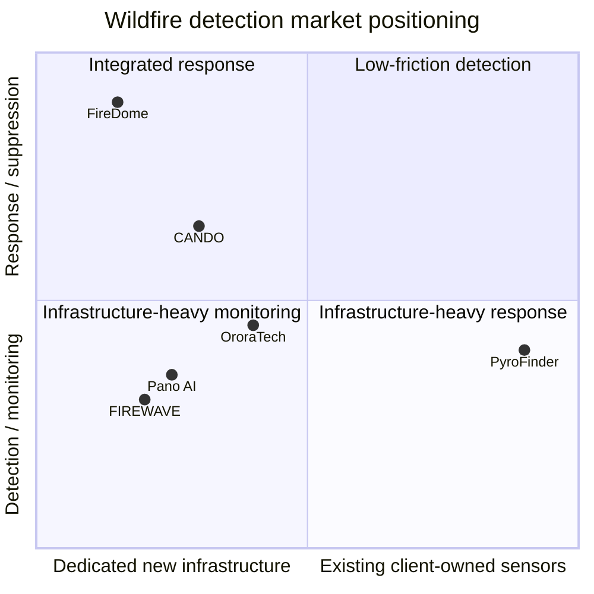

# Market Survey — Wildfire Prediction & Detection Using Existing Client-Owned Sensors

## 1. Page goal and scope

This page surveys existing wildfire detection / monitoring solutions and identifies the market gap for **PyroFinder**: a software-first system that analyzes **sensors the client already owns**, especially security cameras, instead of requiring new towers, drone fleets, satellite infrastructure, or specialized acoustic sensors.

The page should make three points clear:

1. Wildfire detection is an active market with several solution types.
2. Most current solutions depend on **dedicated infrastructure**.
3. PyroFinder is positioned as a **low-friction add-on** for customers who already have cameras and want early smoke / fire detection, alerts, and risk monitoring without major installation work.

---

## 2. Competitors and partial solutions

| System | Approach | Sensor / infrastructure used | Target customer | Main limitation from PyroFinder perspective |
|---|---|---|---|---|
| [Pano AI](https://www.pano.ai/solution) | AI wildfire detection, 360° monitoring, incident verification, alerts, situational awareness | Dedicated Pano Stations: high-vantage panoramic cameras, cloud AI, human review, GIS / weather integrations | Fire agencies, utilities, landowners, emergency response organizations | Strong solution, but it normally requires deployment of dedicated Pano camera stations rather than only using the customer's existing security cameras. |
| [FIREWAVE](https://finder.startupnationcentral.org/company_page/firewave) | Acoustic wildfire detection using IoT sensors and AI trained to recognize fire sound signatures | Specialized acoustic sensor network | Forest authorities, parks, camping areas, high-risk blind spots | Detects by sound rather than image; requires installation and maintenance of dedicated acoustic sensors. |
| [CANDO](https://cando.co.il/en/) | Autonomous drone systems for security, public safety, mapping, surveying, and inspection | Drone fleet / drone-in-a-box infrastructure | Public safety bodies, municipalities, security and inspection customers | Useful for patrol / response, but requires drone operations, airspace coordination, and operational logistics. |
| [OroraTech](https://ororatech.com/all-products/wildfire-solution) | Satellite-based wildfire intelligence, hotspot detection, monitoring, risk and spread analytics | Satellite data, AI analytics, APIs, weather / vegetation / terrain data | National agencies, utilities, insurers, large land managers | Excellent wide-area coverage, but not based on customer-owned local cameras; resolution and update rate depend on satellite coverage. |
| [FireDome](https://www.fire-dome.com/) | Automated wildfire defense and suppression near assets | Visual / thermal sensors, AI decision engine, mechanical launcher, fire-retardant capsules | High-value assets, critical infrastructure, private sites in wildfire zones | Solves a different part of the problem: active suppression and asset defense, not only low-cost detection from existing cameras. |

### Main competitive pattern

The competitors can be grouped into four categories:

- **Camera tower solutions**: strong visual detection, but require dedicated camera stations.
- **Acoustic sensor networks**: useful for blind spots, but require specialized hardware.
- **Drones**: flexible for patrol and response, but operationally complex.
- **Satellites**: excellent large-area monitoring, but less connected to the customer's local security-camera infrastructure.
- **Suppression systems**: valuable after ignition is detected, but require major physical deployment.

**PyroFinder’s market gap:** use the customer’s existing security-camera network as the primary wildfire sensor and add AI detection, alerting, location estimation, and risk context as a software layer.

---

## 3. Comparison table — features / price / audience

| Feature / criterion | PyroFinder | Pano AI | FIREWAVE | CANDO | OroraTech | FireDome |
|---|---:|---:|---:|---:|---:|---:|
| Uses customer’s existing security cameras | **Yes — core idea** | Partial / not the main model | No | No | No | No |
| Smoke / fire visual detection | **Yes** | Yes | No, acoustic | Possible through drone payloads | Indirect hotspot detection | Yes, for local suppression |
| Predictive wildfire risk layer | Planned / recommended | Some weather / GIS context | Limited public information | Not core | Yes — weather, vegetation, terrain, spread analytics | Not core |
| Alerting to customer / responders | **Yes** | Yes | Yes | Operational response dependent | Yes | Yes |
| Location estimation | Camera-based geolocation / map layer recommended | Yes, including triangulation | Sensor-network based | Drone GPS / operator system | Satellite hotspot location | Local asset-defense location |
| Requires new hardware | **No, or minimal edge device only** | Yes, dedicated stations | Yes, acoustic sensors | Yes, drones / drone stations | No local hardware, but external satellite service | Yes, sensors + launcher + capsules |
| Requires public-sector infrastructure | No | Often yes / large organizations | Often forest authorities / parks | Often public safety / enterprise | Often national / large-scale customers | Asset owners / infrastructure sites |
| Best fit | Sites that already have camera coverage | Large fire-prone regions | Camera blind spots and high-risk outdoor areas | Patrol / inspection / emergency support | Country / region / utility-scale monitoring | Protecting high-value assets from nearby spot fires |
| Public price found | Not yet defined | Not public, likely enterprise quote | Not public | Not public | Not public, demo / sales process | Not public, service / meeting-based |

### Price note

Most competitors do not publish clear public pricing. For the page, show the price column as:

- **Public price not listed**
- **Likely enterprise / project-based**
- **Main cost driver:** new hardware, installation, monitoring service, maintenance, and integration.

For PyroFinder, the pricing advantage should be framed as:

> Lower deployment cost because the customer reuses existing cameras and infrastructure.

---

## 4. Screenshots of central features to include

Use screenshots as visual evidence that the market already values dashboards, alerts, map views, and verification workflows. Add screenshots manually to the repository under `data/market-survey/` and reference them here.

| Screenshot to add | Source page | What to capture | Why it matters |
|---|---|---|---|
| Pano AI detection / situational awareness dashboard | <https://www.pano.ai/solution> | Camera view, map, alert / incident workflow | Shows the expected UX standard for visual wildfire detection. |
| Pano AI 360° monitoring explanation | <https://www.pano.ai/solution> | 360° camera-station concept | Shows the main difference: Pano uses dedicated stations, while PyroFinder reuses existing cameras. |
| FIREWAVE acoustic sensor concept | <https://finder.startupnationcentral.org/company_page/firewave> or company LinkedIn | Sensor-network / acoustic-detection explanation | Shows an alternative non-camera approach and the need for specialized sensors. |
| CANDO drone / drone-in-a-box offering | <https://cando.co.il/en/> | Drone operations / public safety page | Shows the operational complexity of drone-based monitoring. |
| OroraTech wildfire platform | <https://ororatech.com/all-products/wildfire-solution> | Satellite hotspot map / wildfire platform | Shows the large-scale satellite intelligence category. |
| FireDome technology overview | <https://www.fire-dome.com/> | Sensors + launcher + capsules workflow | Shows a partial competitor focused on suppression rather than detection-only software. |

Example Markdown placeholder:

```md

```

---

## 5. Design positioning — where PyroFinder is on the map

### Positioning axes

Use a simple 2D map:

- **X-axis:** dedicated new infrastructure → existing client-owned sensors
- **Y-axis:** detection / monitoring only → detection + response / suppression



### Text explanation for the map

PyroFinder should be placed in the **low-friction detection** area: it focuses on early wildfire detection and alerting while using sensors that are already installed at the customer site.

This positioning is different from:

- Pano AI, which uses dedicated high-vantage camera stations.
- FIREWAVE, which uses dedicated acoustic IoT sensors.
- CANDO, which requires drone operations.
- OroraTech, which uses satellite data and a large-scale external monitoring platform.
- FireDome, which requires physical suppression infrastructure.

---

## 6. Design insights — what to adopt, replace, or avoid

### What to adopt

- **Map-first interface**: show every camera, detected smoke / fire location, confidence score, and nearby assets.
- **Alert workflow**: suspected detection → AI confidence → user confirmation → notification.
- **Evidence view**: show the frame / clip that triggered the alert.
- **Risk context**: combine camera detection with wind, temperature, humidity, vegetation, and time of day.
- **False-alarm handling**: collect user feedback to improve the model and avoid repeated false alerts.
- **Multi-camera verification**: if two cameras see the same smoke direction, increase confidence and estimate location.

### What to replace

| Common competitor pattern | Replace with PyroFinder approach |
|---|---|
| Buy and install new detection towers | Connect existing security cameras. |
| Deploy a new acoustic sensor network | Use already available visual streams first. |
| Operate drones for routine detection | Use drones only as optional verification after an alert. |
| Depend only on satellite refresh cycles | Use continuous local camera streams. |
| Offer only detection without customer workflow | Provide alert review, escalation, history, and exportable incident reports. |

### What to avoid

- Overloading the dashboard with too many technical layers.
- Requiring the customer to understand computer-vision terminology.
- Sending raw AI alerts without confidence levels and visual evidence.
- Ignoring camera quality, field of view, and night / weather limitations.
- Claiming complete wildfire prediction from cameras alone; prediction should combine camera data with environmental and historical data.

---

## 7. SCAMPER analysis

SCAMPER helps explain how PyroFinder innovates by modifying existing wildfire-detection ideas.

| SCAMPER question | Application to PyroFinder |
|---|---|
| **S — Substitute**: What do we replace? | Replace dedicated camera towers, acoustic sensors, and drone patrols with the customer’s existing security-camera network. |
| **C — Combine**: What do we combine? | Combine camera-based smoke / flame detection with weather, wind, vegetation, site maps, and alert workflows. |
| **A — Adapt**: What do we adapt? | Adapt security cameras from general surveillance to wildfire monitoring. |
| **M — Modify**: What do we change? | Modify the user experience from “watch many cameras manually” to “receive verified risk-based alerts.” |
| **P — Put to another use**: How can existing assets be used differently? | Use perimeter cameras, parking-lot cameras, and facility cameras as environmental fire sensors. |
| **E — Eliminate**: What do we remove? | Remove the need for new towers, dedicated sensors, public-sector infrastructure, and complex drone operations. |
| **R — Rearrange**: What do we reorder? | Move detection earlier in the response chain: AI watches continuously, alerts humans only when evidence appears, and then supports escalation. |

---

## 8. Datasets and validation plan

The attached source list includes several datasets that can support model prototyping and benchmarking.

| Dataset / source | Type | Use in PyroFinder |
|---|---|---|
| [Dataset for Forest Fire Detection — Mendeley Data](https://data.mendeley.com/datasets/gjmr63rz2r/1) | 1,900 balanced fire / no-fire images, 250×250 RGB | Initial binary classification baseline. Good for early experiments but limited for real security-camera deployment. |
| [Desert/Forest Fire Detection Using Machine/Deep Learning Techniques — Davis & Shekaramiz, 2023](https://www.mdpi.com/2571-6255/6/11/418) | Research article with Utah Desert Fire and DeepFire experiments | Useful for comparing deep-learning architectures and understanding desert / forest domain differences. |
| [DetectiumFire — OpenReview / Kaggle](https://openreview.net/forum?id=vhHYTjMt9Z) | Multi-modal fire image / video dataset with annotations and text prompts | Useful for more advanced detection, localization, captioning, and vision-language reasoning. |

### Recommended evaluation metrics

- Detection accuracy / precision / recall
- False alarm rate per camera per day
- Time-to-detect from first visible smoke
- Performance by time of day
- Performance under haze, dust, fog, clouds, rain, and low light
- Generalization across different camera types and viewpoints
- Location-estimation error when several cameras observe the same smoke plume

### Important validation note

Public fire datasets are useful for prototyping, but the final product must be validated on **real client camera feeds** because security cameras differ strongly in field of view, compression, lens quality, mounting height, and lighting conditions.

---

## 9. Suggested “Related Work” section for the page

| System | Approach | Why PyroFinder is different |
|---|---|---|
| Pano AI | Panoramic camera stations with cloud AI, 360° monitoring, human verification, and wildfire response workflows. | Requires dedicated monitoring stations; PyroFinder is designed to work with cameras the customer already owns. |
| FIREWAVE | Acoustic sensors detect characteristic fire sounds using IoT and AI. | Requires specialized acoustic hardware; PyroFinder is camera-based and uses existing visual infrastructure. |
| CANDO | Autonomous drone systems for security and public-safety operations. | Requires drone operations and airspace coordination; PyroFinder provides continuous monitoring from fixed existing cameras. |
| OroraTech | Satellite-based hotspot detection, wildfire intelligence, and spread / risk analytics. | Excellent for regional monitoring, but PyroFinder provides local continuous monitoring through customer-owned cameras. |
| FireDome | Sensor-based asset protection and automatic fire suppression with capsules. | Focused on active defense and suppression; PyroFinder focuses on low-friction early detection, alerting, and verification. |

Summary sentence:

> PyroFinder uses sensors the customer already owns — primarily security cameras — so no new towers, acoustic sensor networks, drone operations, satellite dependency, or suppression infrastructure are required for initial deployment.

---

## 10. Final design direction

PyroFinder should be presented as a **camera-first wildfire intelligence layer**:

1. Connect existing cameras.
2. Detect early smoke / flame signatures.
3. Estimate location and confidence.
4. Add risk context from weather and site data.
5. Alert the right people with visual evidence.
6. Learn from confirmed / dismissed alerts.

The main differentiation is not only the AI model. The differentiation is the **deployment model**:

> Existing cameras + AI + risk context + alerts = faster adoption and lower infrastructure cost.
